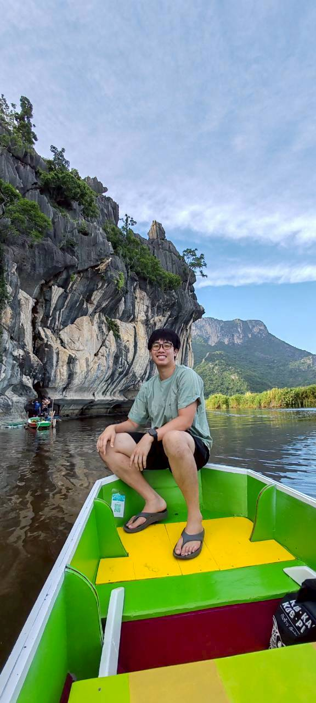

## Background

<!-- CHANGE THIS -->

I went Colby College for my undergraduate degree, double majoring in Data and
Environmental Science. During that time I spent a semester at the Bigelow
Laboratory for Ocean Sciences. My interest in urban spatial analytics stems from
the summer research I conducted with the 7 Lakes Alliance. I performed a 
geochemical and spatial analysis of the sediment in North Pond, identifying the
main source of iron influx which was causing algal blooms. I created a heat map
to communicate this and presented to the local community. Without many 
geospatial classes (all but 2) at Colby, I wanted more experience with 
geospatial analysis, which has led me here to UPenn. I hope to help solve
environmental problems and contribute to urban planning projects in Bangkok, my
home town, to build a more sustainable and accesible city.

## Skills

<!-- CHANGE THIS: update this through the semester as it becomes true -->

- **Languages & Tools:** R, Java, JavaScript, MATLAB, Python, Quarto, Git, GEE
- **Spatial:** (add as you learn)
- **Data:** US Census / ACS via `tidycensus`

## Contact

<!-- CHANGE THIS -->

- Email: canura@upenn.edu
- GitHub: [@canura8818](https://github.com/canura8818)
